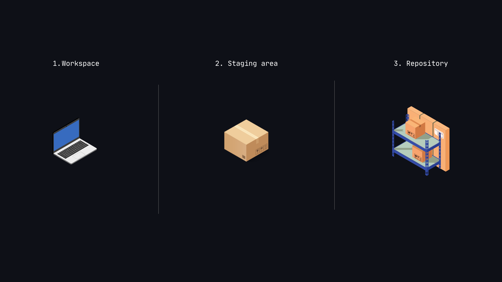

## Version Control System (VSC)

A *VSC* is a tool that helps developers manage changes to code over time. It allows multiple people to collaborate on a project, track modifications, and revert to previous versions if needed. Version control is essential for software development, as it ensures code integrity and enables teamwork.

The basic workflow of a version control system works as the following : 

The first layer is the **workspace**, where files are edited by the user. Once he is done, the user brings his work on the second layer : the **staging area**. But now, he had to correct few things. After correcting, the **workspace** and the **staging area** have now different versions. The user just have to update those changes to the **staging area**. Now, both **workspace** and **staging area** shares the same *version*. This process can be repeated as much as needed, until the user is satisfied of his work. Once it is the case, he can save the current **staging area** version by transfering it to the third layer : the **repository**. The **repository** hosts every *versions* that the user transfered to it. And in any case, the user can reteive every single version of his work by searching in the **repository**.

 

This small process ensures that the user can try new things, without worring of breaking what previously worked, since using it ensures to keep track of every *stable* versions. If an implementation attempt fails, the user can retreive the last transfered version, and start again until succeeding.